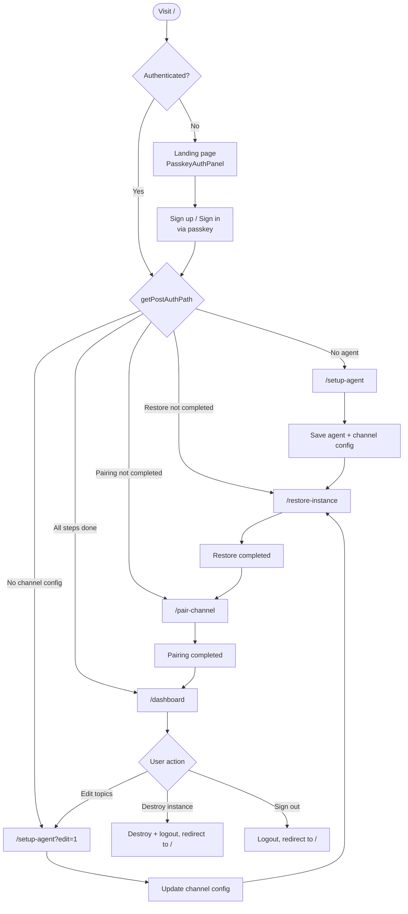
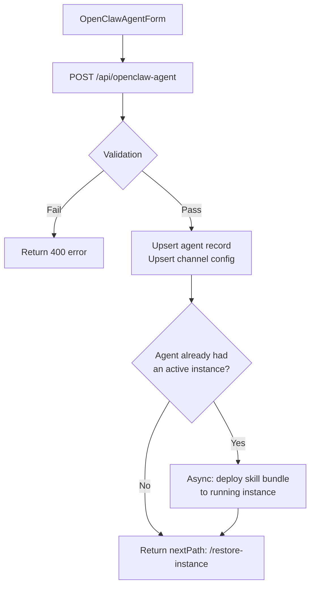
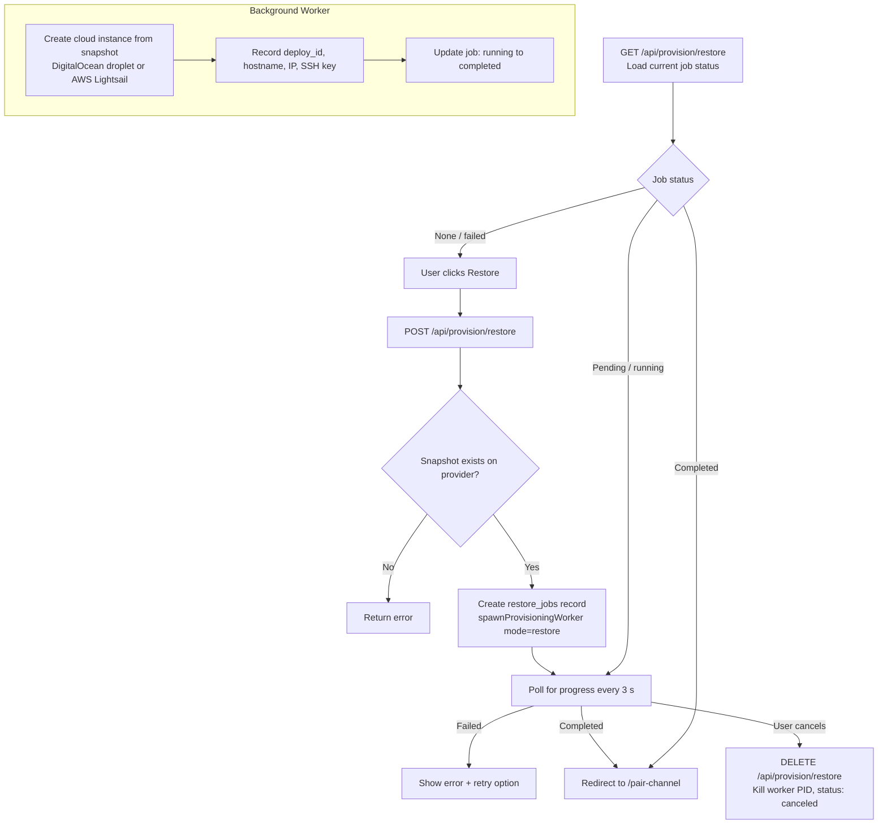
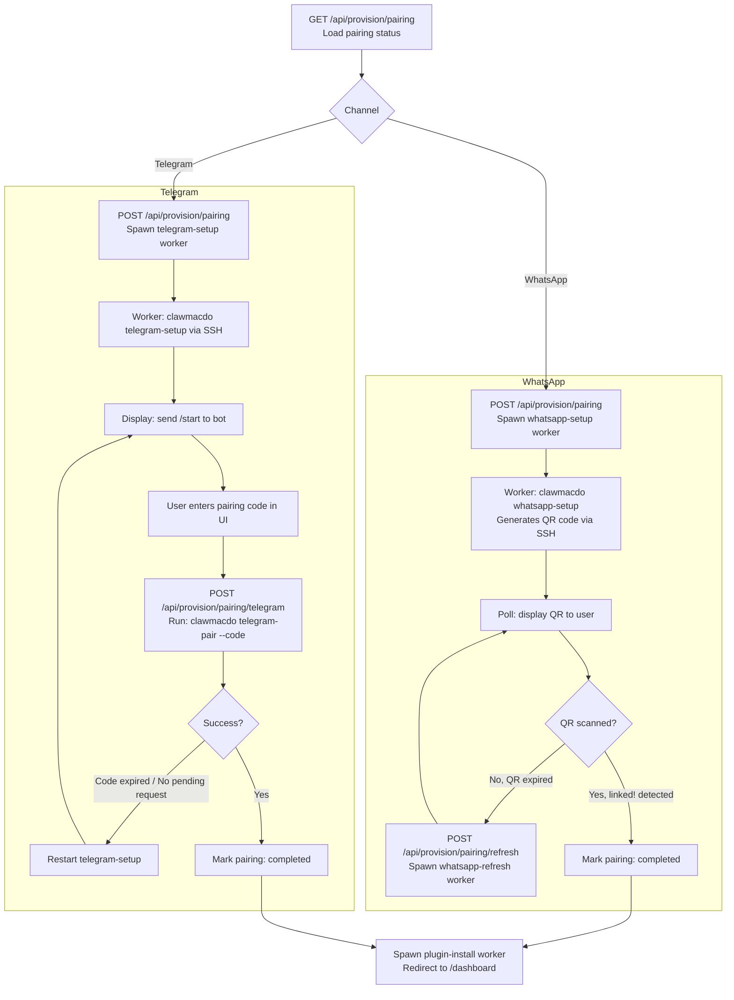
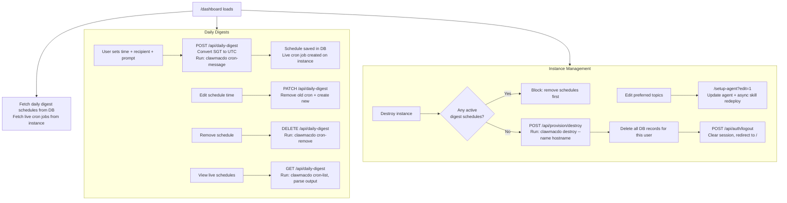
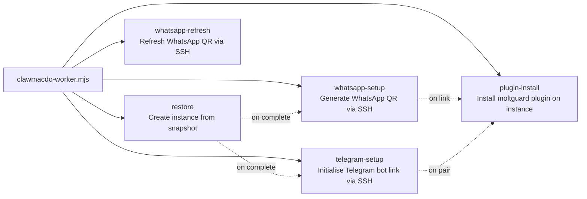

# NewsClaw — App Flowchart

## 1. Top-Level User Journey

---

## 2. Authentication Flow (Passkey / WebAuthn)

```mermaid
flowchart TD
    subgraph Signup
        S1[User enters name + email] --> S2["POST /api/passkey/register/options\nGenerate WebAuthn challenge"]
        S2 --> S3["Browser: startRegistration\nFace ID / Touch ID / Windows Hello"]
        S3 --> S4["POST /api/passkey/register/verify\nVerify + store passkey + create session"]
        S4 --> S5["Set session cookie\nCall getPostAuthPath"]
    end

    subgraph Signin
        L1[User enters email] --> L2["POST /api/passkey/authenticate/options\nGenerate challenge + load passkeys"]
        L2 --> L3["Browser: startAuthentication\nUser authenticates with device"]
        L3 --> L4["POST /api/passkey/authenticate/verify\nVerify + update counter + create session"]
        L4 --> L5["Set session cookie\nCall getPostAuthPath"]
    end

    subgraph Logout
        O1[POST /api/auth/logout] --> O2["Delete session from DB\nClear cookie, redirect to /"]
    end
```

---

## 3. Provisioning Flow

### Step 1 — Agent Setup (`/setup-agent`)

### Step 2 — Workspace Restore (`/restore-instance`)

### Step 3 — Channel Pairing (`/pair-channel`)

---

## 4. Dashboard Flow (`/dashboard`)

---

## 5. API Routes Reference

| Method | Path | Purpose |
|--------|------|---------|
| POST | `/api/passkey/register/options` | Generate passkey registration challenge |
| POST | `/api/passkey/register/verify` | Verify registration, create session |
| POST | `/api/passkey/authenticate/options` | Generate passkey auth challenge |
| POST | `/api/passkey/authenticate/verify` | Verify auth, create session |
| POST | `/api/auth/logout` | End session, clear cookie |
| POST | `/api/openclaw-agent` | Create / update agent + channel config |
| GET | `/api/provision/restore` | Get restore job status |
| POST | `/api/provision/restore` | Start workspace restore |
| DELETE | `/api/provision/restore` | Cancel active restore |
| GET | `/api/provision/pairing` | Get pairing status |
| POST | `/api/provision/pairing` | Start channel pairing |
| POST | `/api/provision/pairing/telegram` | Submit Telegram pairing code |
| POST | `/api/provision/pairing/refresh` | Refresh WhatsApp QR code |
| POST | `/api/provision/destroy` | Destroy cloud instance + reset account |
| GET | `/api/daily-digest` | List schedules + live cron jobs |
| POST | `/api/daily-digest` | Create digest schedule |
| PATCH | `/api/daily-digest` | Update digest time |
| DELETE | `/api/daily-digest` | Remove digest schedule |
| GET | `/api/daily-digest/telegram-chat-id` | Fetch Telegram chat ID from instance |

---

## 6. Background Worker Modes

All workers communicate with the cloud instance over SSH using an encrypted private key stored in the database. They write progress and output back to the `restore_jobs` or `messaging_pairings` tables, which the Next.js API routes poll to serve status to the frontend.
